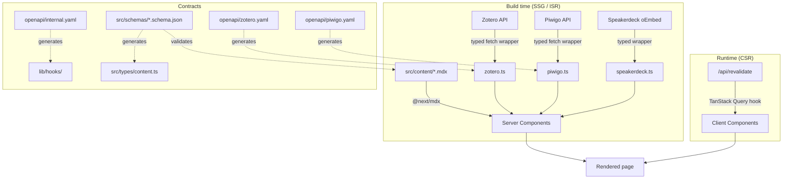

# ADR 003 — API Layer and Data Fetching Strategy

**Date:** 2026-08-04
**Status:** Decided

## Context

The site fetches data from multiple sources:

- **Zotero** — publications, primary research data source (ISR)
- **Piwigo** (`gallery.calques3d.org`) — project image galleries (SSG)
- **Speakerdeck** — presentation embeds via oEmbed (SSG)
- **Internal Next.js API routes** — on-demand revalidation, optional proxying

The site uses a mixed rendering architecture (SSG, ISR, CSR) across the App Router. Data fetching
patterns differ fundamentally between server and client contexts and must be handled accordingly.

## Decision

### 1. Server/client fetch boundary

The App Router hard boundary determines tooling:

| Context           | Rendering       | Fetch mechanism                                |
| ----------------- | --------------- | ---------------------------------------------- |
| Server Components | SSG / ISR / SSR | Native `fetch()` with Next.js cache extensions |
| Client Components | CSR             | TanStack Query + generated typed hooks         |

Next.js extends native `fetch()` with `cache` and `next.revalidate` options. These are the
primary levers for SSG vs ISR vs SSR — no additional query library is needed on the server.

```typescript
// SSG — build-time only, never revalidates
fetch(url, { cache: 'force-cache' })

// ISR — on-demand revalidation only (no time-based TTL)
fetch(url, { next: { revalidate: false }, cache: 'no-store' })
// revalidation triggered via: await revalidatePath('/research/publications')

// SSR — fresh on every request
fetch(url, { cache: 'no-store' })
```

### 2. OpenAPI as source of truth

All APIs — internal and external — are described by OpenAPI 3.1 specifications. Types are
generated from these specs using `openapi-typescript`, not hand-written.

```
openapi spec → openapi-typescript → typed interfaces
                                  → typed server fetch wrappers (SSG/ISR/SSR)
                                  → hey-api client → TanStack Query hooks (CSR)
```

This mirrors the pattern used at HiveMQ (OpenAPI-driven infrastructure with auto-generated
clients) and at Matillion (PACT contract testing). The same approach is applied here.

### 3. Per-API strategy

**Zotero** (primary data source — publications)

- Full OpenAPI 3.1 spec covering the subset of endpoints used: collection items, item detail
- Server-side: typed `fetch()` wrapper generated from spec
- Rendering: ISR with on-demand revalidation (triggered when a new publication is added)
- MSW fixture: snapshot of real Zotero response, validated against schema in CI

**Piwigo** (`gallery.calques3d.org` — project images)

- Partial OpenAPI spec for the Piwigo REST API (album listing, photo listing endpoints only)
- Server-side: typed fetch wrapper
- Rendering: SSG (images are stable; a full rebuild is acceptable on gallery updates)
- Deferred: Piwigo needs an upgrade before integration. Typed interface defined now to
  ease future migration or replacement.

**Speakerdeck** (presentation embeds)

- oEmbed is a standard with a trivial fixed response shape — minimal typed wrapper, no full spec
- Server-side: fetch at build time, render as embed HTML
- Rendering: SSG
- Graceful degradation: if `media.slides` is empty on a project, the slides section is omitted

**Internal API routes** (`/api/*`)

- Full OpenAPI 3.1 spec (`src/openapi/internal.yaml`)
- Routes: `POST /api/revalidate` (ISR trigger), others TBD
- Client-side: TanStack Query hooks generated from spec (CSR routes only)

### 4. Content schema validation

`src/content/` MDX/JSON files are validated against JSON Schema at build time.
Schemas live in `src/schemas/` and are the source of truth for content types.
TypeScript types in `src/types/content.ts` are generated from these schemas.

### 5. File structure

```
src/
  schemas/                        # JSON Schema — content file validation
    position.schema.json
    project.schema.json
    publication.schema.json

  openapi/                        # OpenAPI 3.1 — API contracts
    internal.yaml                 # /api/* routes
    zotero.yaml                   # Zotero REST API (used subset)
    piwigo.yaml                   # Piwigo REST API (used subset)

  lib/
    api/
      zotero.ts                   # generated typed server fetch wrapper
      piwigo.ts                   # generated typed server fetch wrapper
      speakerdeck.ts              # hand-written oEmbed wrapper (trivial shape)
    hooks/                        # TanStack Query hooks — CSR only
      use-publications.ts
```

## Consequences

**Positive:**

- Single source of truth: OpenAPI specs drive both types and MSW fixtures
- Server/client boundary is explicit and enforced by tooling
- External API contracts are documented and testable — schema drift caught in CI
- Consistent with existing professional practice (HiveMQ, Matillion patterns)
- Piwigo and Speakerdeck are behind typed interfaces — replacement or upgrade is isolated

**Negative / Trade-offs:**

- OpenAPI specs for external APIs (Zotero, Piwigo) must be authored and maintained manually
  for the subset of endpoints used — no official machine-readable specs available
- `openapi-typescript` and `hey-api` add toolchain complexity
- TanStack Query is only justified for CSR routes; using it on server components would be
  an anti-pattern

## Alternatives Considered

- **Hand-written types only** — simpler, but no contract enforcement, MSW fixtures can drift
  from real API shapes without CI catching it
- **TanStack Query everywhere** — valid in a pure CSR/SPA; incorrect in App Router where server
  components should fetch directly
- **SWR instead of TanStack Query** — lighter, Next.js-native, but less capable and less
  consistent with existing toolchain knowledge
- **tRPC** — elegant type safety end-to-end, but only covers the internal API surface;
  external APIs still need separate handling

## Data flow diagram



## Related

- ADR 001 — Deployment Target (Vercel + cPanel DNS)
- ADR 002 — Testing Strategy (MSW fixtures, contract tests)
