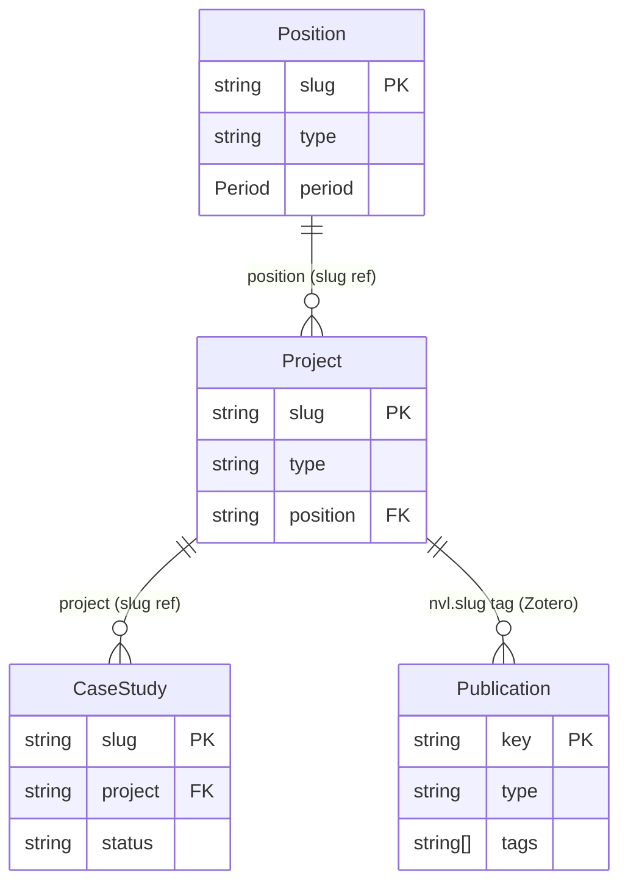

# ADR 014 — Content Model

**Date:** 2026-09-02
**Status:** Decided (retrospective — documents the model as it exists)

## Context

The portfolio site is built around structured content that spans a professional
career from 1996 to the present. Multiple ADRs (003, 012, 013) reference content
entities — positions, projects, publications, case studies — without a single
document defining the full model, entity relationships, storage conventions, or
rendering modes.

This ADR defines the canonical content model. It is the reference document for
all future content and schema work.

## Content entities

### 1. Position

A role held at an organisation: employment, contract, academic appointment,
PhD, freelance, or voluntary.

```
Position
  slug          string       unique identifier (e.g. "hivemq")
  title         string       job title
  organisation  string
  department?   string
  location      string
  period        Period       { start: "YYYY" | "YYYY-MM", end: string | null }
  type          PositionType employment | contract | academic | freelance | phd | voluntary
  tags          string[]
  description?  string
  sites?        PositionSite[]
```

**Storage:** `src/content/positions/{slug}.json`
**Schema:** `src/schemas/position.schema.json`
**Rendering:** Referenced by projects and CV; no dedicated route of its own.

### 2. Project

A distinct body of work within a position. Projects are the primary content unit
for the portfolio's engineering and research sections.

All projects share a common base; two subtypes are discriminated by `type`.

```
ProjectBase (shared)
  slug          string       unique identifier (e.g. "hivemq-edge")
  title         string
  abbr?         string       short label for cards/nav
  type          'research' | 'engineering'
  status        'completed' | 'ongoing' | 'archived'
  visibility    'public' | 'proprietary' | 'redacted'
  featured      boolean      float to top of section listing
  position      string       → Position.slug
  institution?  string       override if different from position
  location?     string       override if different from position
  period        Period
  links         ProjectLinks { github?, linkedin?, external?, live? }
  media?        MediaAssets  { cover?, gallery?, slides? }
  tags          string[]
  description?  string       1–2 sentence summary for card display
  publications? string       Zotero tag for cross-linking papers to this project

ResearchProject extends ProjectBase (type: 'research')
  funding?      string       e.g. "EPSRC", "JISC"
  coordinates?  Coordinates

EngineeringProject extends ProjectBase (type: 'engineering')
  client?       string       omit for NDA work
  role_title?   string       if different from position title
  highlights?   string[]     3–5 bullet points for card view
  artefacts?    string[]     Figma links, screenshots, design files
```

**Storage:** `src/content/{type}/{slug}.mdx` — frontmatter carries the structured
fields above; MDX body is optional narrative prose.
**Schema:** `src/schemas/project.schema.json`
**Rendering:**
- Research: SSG at `/research/[slug]` (frozen academic content)
- Engineering: SSG at `/engineering/[slug]` (stable once written)
- `visibility: redacted` projects render a card only — no detail route

### 3. Publication

A bibliographic record sourced from the Zotero API. Not stored as a local
content file — fetched and normalised at request time.

```
Publication
  key           string       Zotero item key (8-char alphanumeric)
  type          PublicationType  conferencePaper | journalArticle | bookChapter | thesis | report | patent
  title         string
  authors       string[]
  year          number
  venue?        string       proceedings or journal name
  eventName?    string       conference short name
  place?        string       conference location
  pages?        string
  abstract?     string
  doi?          string
  pdf?          string       ownCloud filename — served via /publications/[key]/pdf
  tags          string[]     includes project slugs for cross-linking
```

**Storage:** Zotero API (external). No local file.
**Schema:** Type defined in `src/types/content.ts`; no JSON schema (not a local file).
**Rendering:** ISR at `/research/publications` — on-demand revalidation when
the Zotero collection changes.

**Cross-link to projects:** A publication's `tags` array contains project slugs
(e.g. `"calques3d"`). The project's `publications` field contains a Zotero tag
string (e.g. `"calques3d"`). The relationship is matched at render time — no
explicit reference stored in either direction.

### 4. Case Study

A long-form narrative tied to a project. First-class content entity with its
own route, layout, and visual identity. See ADR 012 for the full decision.

```
CaseStudy
  slug          string       short identifier within its project (e.g. "agentic")
  project       string       → Project.slug (engineering or research)
  title         string
  status        'draft' | 'published'
  featured      boolean
  tags          string[]
```

A case study may optionally contain ordered chapters, discovered automatically
from co-located `chapter-{n}.mdx` files.

```
ChapterMeta
  slug          string       e.g. "chapter-1"
  number        number
  title         string
```

**Storage:** `src/content/case-studies/{project}--{slug}/index.mdx` (flat,
globally unique directory names using `--` separator).
**Schema:** `src/schemas/case-study.schema.json` (to be created — ADR 012 step 4)
**Rendering:** SSG at `/case-studies/[project]/[slug]`

### 5. CV data

Structured data supplementing Position entries. Not associated with any
individual project. Used to render the `/cv` route.

```
EducationRecord
  degree        string
  institution   string
  location      string
  period        { start: string, end: string }
  description?  string

SkillGroup
  id            string
  label         string
  skills        string[]
```

**Storage:** `src/content/cv/education.json`, `src/content/cv/skills.json`
**Schema:** `src/schemas/education.schema.json`, `src/schemas/skill-group.schema.json`
**Rendering:** ISR at `/cv` — changes with career milestones.

### 6. ADR

Architecture Decision Records. Read from `.docs/adr/` — not copied to
`src/content/`. Exposed on the site as part of the engineering portfolio.

```
ADR
  slug          string
  number        number
  title         string
  status        'open' | 'proposed' | 'decided' | 'superseded' | 'deprecated'
  date          string       ISO date "YYYY-MM-DD"
  tags          string[]
  supersedes?   number[]
  superseded_by? number
```

**Storage:** `.docs/adr/{NNN}-{slug}.md`
**Schema:** `src/schemas/adr.schema.json`
**Rendering:** SSG at `/engineering/adr/[slug]`

---

## Entity relationships



All relationships are **forward references** stored in the child entity.
Back-references are **computed at build time** in `lib/content/` or `lib/api/`.

| Relationship | Direction | Mechanism |
|---|---|---|
| Project → Position | forward | `project.position` — stored in frontmatter |
| CaseStudy → Project | forward | `case_study.project` — stored in frontmatter |
| Publication → Project | forward | `nvl.<slug>` tag in Zotero — extracted during transform |
| Position → Projects | computed | `getProjectsForPosition(slug)` |
| Project → CaseStudies | computed | `getCaseStudiesForProject(slug)` |
| Project → Publications | computed | `getPublicationsByProject(slug)` |

---

## Storage conventions

```
src/
  content/
    positions/      {slug}.json          — Position records
    research/       {slug}.mdx           — ResearchProject (frontmatter + prose)
    engineering/    {slug}.mdx           — EngineeringProject (frontmatter + prose)
    case-studies/   {project}--{slug}/   — CaseStudy directories (flat)
                      index.mdx
                      chapter-{n}.mdx   (optional, ordered)
                      *.md / *.mdx      (optional satellite content)
    cv/
      education.json
      skills.json

  schemas/          *.schema.json        — JSON Schema for all local content files
  types/
    content.ts                           — TypeScript types (generated from schemas)
  lib/
    content/
      positions.ts                       — getAllPositions(), getPositionBySlug()
      research.ts                        — getAllResearchProjects(), ...
      engineering.ts                     — getAllEngineeringProjects(), ...
      case-studies.ts                    — getAllCaseStudies(), ... (ADR 012)
      cv.ts                              — getSkills(), getEducation()

.docs/
  adr/              {NNN}-{slug}.md      — Architecture Decision Records
```

---

## Rendering mode table

| Route | Content source | Mode | Revalidation |
|---|---|---|---|
| `/research/[slug]` | `src/content/research/` | SSG | — |
| `/engineering/[slug]` | `src/content/engineering/` | SSG | — |
| `/case-studies/[project]/[slug]` | `src/content/case-studies/` | SSG | — |
| `/research/publications` | Zotero API | ISR | on-demand |
| `/cv` | `src/content/cv/` + positions | ISR | on-demand |
| `/engineering/adr/[slug]` | `.docs/adr/` | SSG | — |
| `/experiments/[slug]` | code only | CSR | n/a |

---

## Consequences

**Positive:**
- Every entity type has a clear home, schema, reader, and rendering mode
- Forward-ref-only convention means content files never need to be updated in
  two places when a relationship is added
- Zotero remains the authoritative bibliographic source; publications are not
  duplicated as local files
- Case studies are designed to extend the model without affecting existing entities

**Negative / Trade-offs:**
- Computed back-references mean the content reader must scan all entities of one
  type to answer "what projects does position X have?" — acceptable at SSG scale,
  would need caching at ISR scale
- `Publication ↔ Project` cross-linking via Zotero tags is informal; a misspelled
  tag silently breaks the link rather than failing validation

## Related

- ADR 003 — API layer and data fetching (fetch strategy per rendering mode)
- ADR 012 — Case Study Content Architecture (case study detail)
- ADR 013 — Case Study Content Location (future: decoupling content from app repo)
- `src/types/content.ts` — authoritative TypeScript type definitions
- `src/schemas/` — JSON Schema source of truth for local content files
