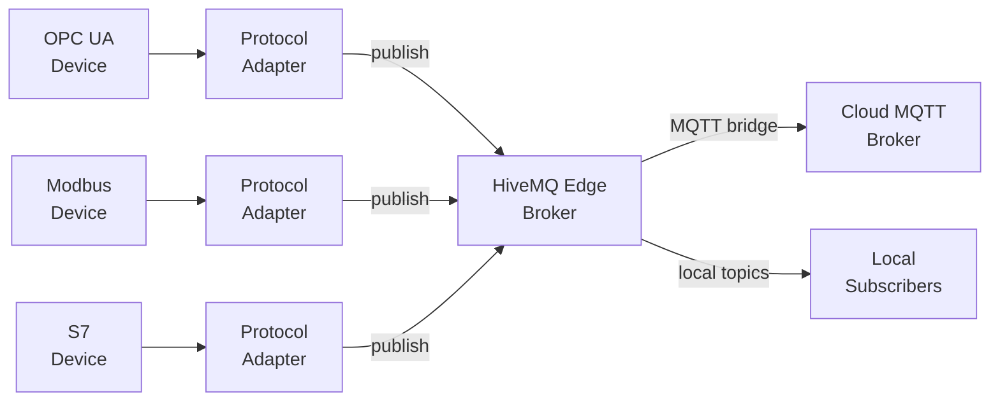

HiveMQ Edge is an open-source industrial IoT gateway. Protocol adapters translate device data
from OPC UA, Modbus, Siemens S7, and a dozen other field protocols into MQTT, making
factory-floor sensor data available to cloud analytics pipelines without replacing the devices
that produce it. I joined as Lead Frontend Engineer at inception in April 2023 and have owned
the entire UI — architecture, features, testing infrastructure, and accessibility — since.

The people who configure these deployments are automation engineers, not web developers.
They think in PLCs, signal hierarchies, and topic trees — not REST APIs or JSON config files.
Every design decision had to start from that reality.

## The Workspace Canvas

The central premise of the UI is that the network topology *is* the product's mental model. If
an operator can see their adapters, bridges, and data flows as a connected graph, they
understand their deployment. That insight drove the choice of React Flow as the foundation for
the main workspace.

State is split across two layers. Zustand owns the canvas — node positions, selected state,
viewport coordinates, workspace mode flags, and wizard lifecycle. React Query owns the server
state — adapter configurations, connection health, live topic counts. The split is deliberate:
canvas interactions must be instantaneous (no network round-trips when dragging a node), while
configuration data must stay consistent with what the broker actually knows. The two layers
never fight because they model genuinely different things.

Node types are extensible: the same canvas hosts protocol adapters, MQTT bridges, combiners,
Pulse agent nodes, and groups — each with its own React Flow custom renderer, colour coding,
and contextual action menu. Workspace health propagates through the graph at the store level,
not at render time, so a single adapter going offline cascades correctly through bridges and
combiners that depend on it without a cascade of local state updates.

## Auto-Layout: Domain Knowledge as Algorithm Design

As workspaces grow, nodes scatter. A deployment with thirty adapters feeding five bridges and
two combiners produces a graph that is accurate but unreadable without spatial structure. The
solution was a multi-algorithm layout system with four options: Dagre (hierarchical TB and LR),
WebCola (physics-based force-directed), and a custom Radial Hub layout.

The Radial Hub is the most architecturally interesting. It is not a generic graph layout
borrowed from a library — it encodes product-specific topology knowledge. The Edge broker is
always the visual centroid; adapters and bridges radiate outward as spokes. This works because
the product's topology *is* a hub-and-spoke pattern: every data flow passes through the broker.
A general-purpose force-directed algorithm doesn't know that; the Radial Hub bakes it in.

The layout system is modular: adding a new algorithm means implementing one interface. Layout
presets persist to localStorage. A keyboard shortcut (⌘+L / Ctrl+L) makes the feature
accessible to power users without cluttering the toolbar. Visual regression snapshots with
Percy guard against layout regressions on every PR.

## Creation Wizard: Ghost Nodes and Progressive Disclosure

The hardest UX problem on any topology editor is creation. Adding a new entity to a live,
populated graph risks disorienting the operator — they need to know where the new node will
appear and how it will connect before committing.

The solution is a ghost preview system. As soon as the creation wizard opens, a
semi-transparent node (60% opacity, dashed border, blue glow) appears on the canvas in
real-time, positioned automatically relative to the existing topology. The ghost updates as
the wizard progresses and resolves to a fully rendered node on successful submission. The
background workspace remains fully visible throughout — the wizard panel sits alongside it,
never on top of it.

The wizard shell is a Zustand state machine (IDLE → SELECTING → CONFIGURING → COMPLETE),
cleaned up atomically on cancel or completion. A `wizardMetadata` registry maps entity type to
wizard steps to components, making the system extensible without touching the shell: adapters,
bridges, combiners, and asset mappers all use the same scaffolding with swapped content panels.
Component reuse is high — the configuration forms are identical to those used in the
non-wizard flows, wrapped in wizard context rather than duplicated.

The Group wizard extends the pattern further. Users select nodes directly on the canvas to
define group membership; the ghost boundary updates in real-time as each node is added, and
constraint validation ("minimum 2 nodes") gates the Next button. Workspace interaction is
locked at the store level during wizard sessions — no accidental nested creation flows.

The two wizard phases together changed 231 files and added over 45,000 lines across 74 tests.
WCAG 2.1 AA compliance and `prefers-reduced-motion` support for ghost animations were
requirements, not afterthoughts.

## OpenAPI-Driven Type Safety End-to-End

The test suite runs over 5,000 tests across Vitest, Cypress Component Testing, Cypress E2E,
and Percy visual regression. The structural challenge is keeping it honest as the API evolves.

Raw `cy.intercept('GET', '/api/v1/adapters')` calls are fragile. If an endpoint path changes,
the intercept silently matches nothing; the test may still pass while testing nothing. A URL
typo — `api/v1/...` without the leading slash, or `/adaptors` vs `/adapters` — is invisible
until a test mysteriously fails in CI on a different machine.

The solution is a generated `apiRoutes.ts` registry, rebuilt on every `pnpm dev:openAPI` run
from the live OpenAPI specification. Routes are typed using a phantom-type pattern
(`Route<T>` and `ParametricRoute<T, Template>`), making it a TypeScript error to mock a route
with the wrong response shape. A typed `cy.interceptApi('getAdapters')` wrapper replaces bare
intercept strings, resolving the path from the registry and validating the mock against the
schema at the call site — IDE-time error, not test-failure-time.

A custom ESLint rule, `local/no-bare-cy-intercept`, enforces the new convention with three
diagnostic categories: bare string intercepts, missing leading slash, and Levenshtein-distance
near-misses (threshold: 3 characters). The rule offers an IDE quick-fix that rewrites the call
and adds the import in a single action.

Migrating the existing suite required an AST-based codemod. The dry run across the full
codebase found 617 auto-migratable call sites across 146 files — and surfaced 59 pre-existing
type mismatches in test mocks that had been silently passing against incorrect response shapes.
Those 59 mismatches were real latent bugs, not false positives. That is the concrete return on
the infrastructure investment.
