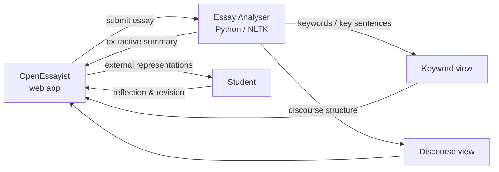

The SAFeSEA project was an EPSRC-funded collaboration between The Open University and Oxford
University, investigating how extractive summarisation techniques could be used to analyse
students' essays and generate appropriate formative feedback.

Writing summaries has been a long-standing educational activity but using summaries of your own
writing as a source of reflection remains a more open issue. Can existing methods of information
extraction and summarization be adapted to select content for feedback? How effectively can these
methods deliver feedback? What effect do these techniques have on essay improvement, both within
current and future drafts, and on self-regulation and metacognition?

My principal responsibility on the project was to design and evaluate the prototype of a
web-based application (called OpenEssayist), as an experimental platform for addressing these
questions. The context of application was to support OU students in writing their assignment
essays for real postgraduate modules. Given the parameters of the targeted deployment (1500+ word
open-ended essays, online & distance education, uneven conditions for writing), I focused on a
more open, discovery-based environment, where various external representations of the
summarisation elements would be offered to students for them to explore on their own initiative.

The main design duties consisted of integrating the summarisation tools developed by the
computational linguists at Oxford, developing the web application infrastructure, designing the
various external representations deployed in the system, building the overall navigation, and
developing the monitoring and data mining tools. The design was supported by several sessions of
formative evaluation: focus groups in the early stage, desirability and usability testing, and
accessibility testing.

The OpenEssayist system was deployed for two successive evaluations in real-life conditions: a
first group of 32 students at the OU, followed by three groups running simultaneously at the OU
(48 students), Hertfordshire University (12 students) and the British University in Dubai (20
students).
